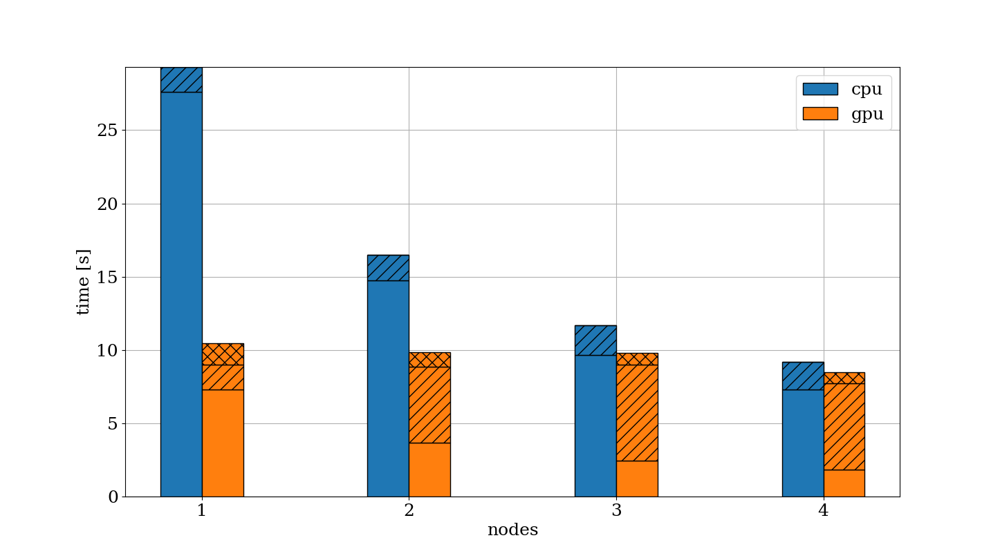

# Development tools for scientific computing
Gabriele Codega, gcodega@sissa.it, AMMA

Code for the exam in Development tools for Scientific Computing, SISSA, a.y. 2024-2025.

---

## Parallel matrix-matrix multiplication
The goal here was to implement matrix-matrix multiplication in distributed memory. The core idea is to split the matrices we want to multiply between MPI processes, and let each process compute a chunk of the result. Since we are in distributed memory, some communication is required for each process to properly compute its chunk of the result, but ultimately each process needs some matrix-matrix multiplication routine to do its work. The efficiency of the underliying multiplication routine can severely affect the performance of the distributed algorithm. Different matrix-matrix multiplication routines are provided in `src/matmul/routines.py`, all of which can be used in the distributed routine. The actual distributed machinery is provided in `scripts/run.py`.

All the code is implemented in Python. NumPy is employed to manipulate the matrices, while Numba is used to JIT compile routines in serial, parallel, CPU and GPU code. The MPI is provided by mpi4py.

This package tries to install mpi4py with `pip`, which requires a working installation of MPI on the machine. Also, for GPU computing, a recent version of the CUDA Toolkit is required (see [Numba](https://numba.readthedocs.io/en/stable/cuda/overview.html) for details).

### NVHPC
As it turns out, NVHPC ships with all is needed here. One issue is that mpi4py is not really meant to be compiled with nvc by default. If you have issues while installing you may want to try this
``` bash
CFLAGS=-noswitcherror python -m pip install --no-cache-dir --no-binary=mpi4py mpi4py
```
You may also have to set `CUDA_HOME`, `NUMBAPRO_NVVM` and `NUMBAPRO_LIBDEVICE` environment variables. For example
``` bash
export CUDA_HOME=$NVHPC_ROOT/cuda/12.0
export NUMBAPRO_NVVM=$NVHPC_ROOT/cuda/12.0/nvvm/lib64
export NUMBAPRO_LIBDEVICE=$NVHPC_ROOT/cuda/12.0/nvvm/libdevice
```
Finally, should you run any of this code on an HPC facility and submit a SLURM job, note that SLURM's `srun` might not work with mpi4py, and you may need to use `mpirun` instead.

## Run some tests
To check out how different routines perform you can run `scripts/run.py`. After installing the package, you can modify `examples/config.yaml` by specifying the following parameters:
- `device`: either 'cpu' or 'gpu', depending on what device you want to run your code on
- `size`: one integer that determines the size of the two matrices to be multiplied (assuming square matrices)
- `function`: requires two fields
    - `routine`: name of the routine you want to use, as implemented in `src/matmul/routines.py`
    - `block_size`: an integer that determines the size of the blocks in tiled matrix multiplication. For the non-tiled routines this is required for signature consistency but is not actually used. For the GPU routine this needs to be consistent with the `BLOCK_SIZE` variable in `src/matmul/routines.py`, and ideally with the grid dimension used to invoke the kernel.
- `print`: either `True` or `False`, whether to print the result

You can run the script with
```
mpirun -n <ntasks> python scripts/run.py --config experiments/config
```
Note that if you want to run this in serial you still need to use `mpirun -n 1 ...`

### Profiling
The script will print to screen the time spent in multiplying the matrices (i.e. no communication time or others). You can get more insights by profiling the code with kernprof. The script in `shell/submit.sh` lets you run one instance of kernprof for each MPI task and save the results on different files. You can select the number of threads for parallel routines by changing `NUMBA_NUM_THREADS` and customize the output path for kernprof. Run the script as
```
mpirun -n <ntasks> shell/submit.sh
```
The script also provides an example of how you could profile the code with valgrind to check the cache efficiency of different routines. Note that using valgrind with Python is really not optimal, since typically the interpreter makes a lot of function calls and it is not easy to identify which calls refer to specific lines in your code. If cache utilisation is substantially different between two routines you can still expect to see differences in the valgrind summary.

# Notes on the implementation
## Distributed algorithm
Suppose we want to multiply two matrices $A$ and $B$, with shape $M\times K$ and $K\times N$. The result $C$ will have shape $M\times N$. 

The idea is to distribute rows of $A, B$ and $C$ as evenly as possible between MPI tasks, and let each task compute only a piece of the output. The issue is that to compute a single entry $C_{ij}$ we need a full row of $A$ -- which we have available in each task -- and a full column of $B$, which is not directly available in a given task. This means that in order to compute its own chunk of $C$, each process will need to get some data from every other process, that is processes need to communicate.

Communicating a single column of $B$ every time it is needed introduces too much of an overhead and slows down computations significantly, so instead we communicate a bunch of columns together, so that instead of computing one single entry of $C$ per communication, we can compute a small block.

Assume that the workload is perfectly balanced, so that each process gets $n_{loc}$ rows of $A, B$ and $C$. Then every time we do a communication, we can let each process share with every other process $n_{loc}$ columns of $B$, so that after communication each process ends up having its own chunk of $A$ ($n_{loc}\times K$) and an extra chunk of $B$, say $B_{col}$, of size $K\times n_{loc}$. This is all we need to compute a chunk of $C$ of size $n_{loc}\times n_{loc}$.

With this method, after $n_{tasks}$ communications we have the full result $C$.

In practice we can use `MPI.Allgatherv` for communications, so that each process gets what they need from every other process (also accounting for possible small workload imbalance). To actually perform communications we need the send buffer to be a contiguous memory region, which is not our case if the matrices are stored in row-major order, so before being able to cmmunicate we need to copy the portion of $B$ we want to share in a contiguous memory buffer ($B_{block}$). This operation introduces another overhead to communications. Moreover, we should note that together with $A$, $B$ and $C$ we also need to store $B_{col}$ and $B_{block}$, which can be expensive in terms of memory.

The algorithm goes something like this
```
// share workload and initialise matrices

for i = 1...n_tasks
    create_block(B,B_block)
    MPI.Allgatherv(B_col, ..., B_block, ...)
    matmul(A, B_col, C) // we need to make sure we write in the correct locations of C
```

In this process, `matmul` can be whatever routine that can be used by a single process locally, and indeed we shall see that different routines can alter the performance significantly. It should also be pointed out that the routine does not need to run on CPU at all. Indeed, we can use a GPU kernel to perform the local products blazing fast, at the cost of being extra careful in managing memory.

In particular, when using a GPU kernel we need to move $A$ and $B_{col}$ to device in order to compute their product. While $A$ can be moved once, before starting the loop, $B_{col}$ may need to be moved from host to device in every loop iteration. This can be avoided if using a CUDA aware implementation of MPI, which can directly communicate device buffers without the need of extra copies. The take-home message here is that using a GPU kernel can massively speed up local computations, but it is only worth using if we can avoid lots of memory transfers from host to device and vice versa.

## Shared memory multiplication
As already noted, the local multiplication routine can be whatever, so I went ahead and implemented a bunch of algorithms to see how they perform. 

CPU routines have the same signature `void(double[:,:],double[:,:],double[:,:],int)`, where the arrays are $A$, $B$ and $C$, while the integer is the dimension of a tile for the tiled algorithms. The signature is the same simply because it was convenient, however, non-tiled routines do not make use of the tile size. 

GPU routines have signature `void(double[:,:],double[:,:],double[:,:])`, where the arrays are device arrays and the tile size is gone since it is needed at compile time. These also need to be called as `routine[gridSize, blockSize](A,B,C)`, where the arguments in square brackets determine the layout of GPU threads (this is how CUDA works, I don't make the rules here).

Matrix multiplication is a memory-bound problem, meaning that the biggest bottleneck is not computation but memory access. In each routine then we try to explore how different memory access patterns affect the performance.

### Naive
This is the standard triple for loop over `i,j,k`. We compute `C[i,j] += A[i,k] * C[k,j]`, with `k` being the fastest index. Actually, instead of directly incrementing `C[i,j]`, we use a local accumulator to be a bit more cache-friendly. This is already very slow for large matrices, so we at least use Numpy arrays (instead of lists).

### Loop reordering
It turns out that iterating through `i,k,j` is much more cache-friendly, since we also iterate through $B$ in row major order. This is a big improvement over the naive implementation. There are two routines with loop reordering, both JIT compiled with Numba: one serial and one parallel. The parallel version distributes the rows of $C$ among threads (i.e. the loop over `i` is parallel).

### Blocking (or tiling)
This should be the most efficient algorithm in terms of cache utilisation (emphasis on *should*). The idea is that we access the matrices in small blocks that can fit into cache, so as to reduce cache misses. This means that we basically use a small block of $A$ and $B$ to compute the partial result of a small block of $C$, and iterate over the blocks until the whole product is computed. This clearly is way less straight forward with respect to the previous implementations, but in theory it should be much more efficient.

Difficulties here stem from the fact that choosing the best block size is not easy, as it strongly depends on the hardware (mainly on cache size). This, together with the fact that there are three more `for` loops and more complex boundary checking, can make this method slower than the previous. 

As before, there are two JIT compiled implementations, serial and parallel, none of which I managed to make run faster than the loop reordering routines. 

(I even tried plain C implementations with memory alignment and explicit avx512 instructions, but the improvement over loop reordering was not substantial at all)

### GPU simple
GPUs have virtually infinite threads, in the sense that the overhead for thread creation and contex swapping is really small. This means that we can make each thread compute a single entry of $C$. If the thread has indices `i,j` in the grid, we simply iterate over `k`, accumulate `A[i,k] * B[k,j]` and set the final value of `C[i,j]`. We just need to make sure that we have enough threads to fully cover $C$ and we should check if some threads are out of bounds and do not need to compute anything.

### GPU blocked
The idea is pretty much the same as for the CPU version, only this time we have unlimited threads. The whole point here is once again to improve cache efficiency, which can be done by using CUDA shared memory arrays. Indeed, threads in the same block can access an L1 cache which is much faster than the global shared memory. We can exploit this cache by creating shared arrays that fit in cache and contain blocks of $A$ and $B$, and use these to compute the partial result in a block of $C$. We iterate through blocks until the full result is computed. 

The parallel capabilities of GPUs make this blocked algorithm much more useful and efficient with respect to the CPU counterpart.

## Results
Let's start by saying that the CPU routines are not nearly as fast as Numpy routines, which was expected, while the blocked GPU routine apparently is as fast as PyTorch `matmul` routine, which was *not* expected.

A first interesting comparison is the runtime for different routines and increasing matrix size. In the figure we can see the comparison between the serial routine (loop reordering) on a single core, the same routine used with MPI in distributed memory, the parallel routine with loop reordering on a single MPI task, and the blocked GPU routine on a single GPU. The hardware for this test consists of an 11th Gen Intel Core i7-11700 @ 2.5GHz and a single NVIDIA Quadro RTX GPU.

The solid boxes represent actual computational time to compute the product, the parallel hatch represents communication time, and the cross hatch is time to copy memory from host to device and vice versa.

We can see that the GPU routine is the fastest, followed by the two parallel CPU routines, which are comparable, and finally the serial routine. Curiously, for the smallest size the MPI routine is slower than the serial, possibly due to resources contention between processes. The shared memory routine is slightly faster than the MPI version, which again is possibly due to resource contention. 

In this case the communication time is very small since all the processes run on the same physical CPU, while host-device synchronization is already noticeable.

The execution time for blocked CPU routines was typically twice as large as the loop reordering routines, this is why they are omitted here. Remember that the whole point of using blocked routines is to improve cache utilisation, which should lead to faster execution times. Since we are not getting faster routines, we may want to check if the cache misses are indeed fewer for the blocked routine, but unfortunately this is not straight forward to do in Python. Indeed, using a tool like valgrind to profile cache utilisation is not very informative here, since the Python interpreter makes lots of function calls and it is very hard to interpret the results. A possible workaround is to implement the same routines in C, which is much more well suited for valgrind, to see if we can at least hope that the Python implementations will do what we expect.

The table shows results obtained by profiling the naive, loop reordering and blocked routines implemented in C. Matrix size was $1024\times 1024$ and the code was compiled with `gcc` and `-O3` optimisation flag.

| Routine | Dr | D1mr | DLmr | Dw | D1mw | DLmw |
|---------|----|------|------|----|------|------|
| naive (accumulate) | 1,610,612,736 (42.2%) | 1,076,239,361 (79.5%) | 132,716 (14.8%) | 0 | 0 | 0 |
| naive (set $C_{ij}$) | 0 | 0 | 0 | 1,048,576  (0.1%) | 1,048,576 (53.2%) | 114,895 (14.2%) |
| loop reordering | 1,073,742,848 (28.1%) | 134,349,825  (9.9%) | 261,121 (29.1%) | 536,873,984 (48.4%) | 0 | 0 |
| blocked | 1,073,992,704 (28.2%) | 142,525,434 (10.5%) | 239,472 (26.6%) | 536,971,264 (48.4%) | 0 | 0 |

The column headers follow valgrind's notation. Specifically, `1` and `L` indicate first and last level cache, `r` and `w` refer to data read and write, respectively, and `m` stands for miss.

We can see that the naive version misses substantially more than the others, both in reading and in writing data, which is expected. In fact, the loop reordering and blocked routines do not miss at all in writing, and the difference between the two is very small. Things are not looking good for the blocked routine. In fact we see that it misses slightly more level one reads, but compensates by missing less last level ones. Is this enough for it to be the best routine? As it turns out, yes! (But just marginally). What happens here is that we do not really see information about level two cache, which might be the one making a difference. Indeed, there results are obtained for a block size equal to 148, which is almost perfect to fill the L2 cache. So does the same block size yield similar results for the Python code? Unfortunately, no. It is possible that the (small) speedup in the blocked routine is mostly due to compiler optimisations, which may not be available for the JIT compiled Python code.

To avoid undesired trouble, we set aside the blocked CPU routine and test how the parallel loop reordering CPU routine and blocked GPU routine scale for large matrices. The results reported here were obtained by running the code on Ulysses at SISSA. The nodes are equipped with 2 Intel Xeon E5-2683 v4, with 16 cores each and hyperthreading enabled (for a total of 64 threads), and 2 NVIDIA Tesla P100 GPUs. In the experiments, each node was assigned 2 MPI tasks, each with 32 threads and 1 GPU (just for the GPU routine). A good matrix size was $10000 \times 10000$ for the CPU routine and $20000 \times 20000$ for the GPU routine. In the figure we can see the runtime for increasing number of nodes.



As before, solid bars are the multiplication time, parallel hatches are communications and cross hatches are host-device synchronisation. We notice that the GPU routine is much faster than the other, in spite of the matrix being four times the size. Moreover, we can see that the time for communication is larger for two or more nodes, which is both due to the larger number of MPI tasks and -- most importantly -- to the fact that these communications are internode and thus happen over the network, which is slower. Finally, we can see that the time for multiplication decreases with increasing number of nodes, which is what we expect. This is best appreciated by looking at the speedup in the following figure.


Here we can see that for both routines the speedup for multiplication is almost ideal. When also factoring in the communication and synchronisation times we get larger deviations from the ideal speedup, which also depend on the details of the machine.

To better understand the influence on the total execution time for large matrices and many processes, we can look at the results obtained by profiling the code with kernprof and line_profiler.
 

 

We observe that both for CPU and GPU, on one single node most of the time is spent in computations (`t2.synchronize` for the GPU charts, since kernel execution is asynchronous and we rely on CUDA events for timing), whereas on four nodes, since the computation time is much smaller, MPI overhead dominates. In particular, for the CPU the most time is spent in initialising MPI, which is not so bad as this is done once. For the GPU, on the other hand, it is communications that take the longest, which is possibly a serious performance issue. This big difference in communication times between CPU and GPU implementations (which we can also see from bar charts) is not expected and it might be due to the specific network state at the time of the experiments. It is also interesting to notice that the time to initialise the matrices also reduces significantly with increasing number of nodes, which is indeed what we expect since the total workload is fixed. Notice that for the GPU implementation, a substantial slice of the pie is occupied by memory transfer from host to device and vice versa.

## Conclusion
Let's wrap up the discussion by stressing once again that this code was not meant to compete with BLAS or cuBLAS by any means, and that if performance is of paramount importance one is better off by just using some highly optimized compiled code. Nonetheless, we have seen that with Python one can get good performance with minimal effort, by exploiting tools like Numba for JIT compilation (on GPU even) and mpi4py for distributed computing. Moreover, tools like kernprof make it very easy to profile code, find bottlenecks and study scalability properties, so long as one is not interested in low-level performance indicators (such as cache utilisation). 
